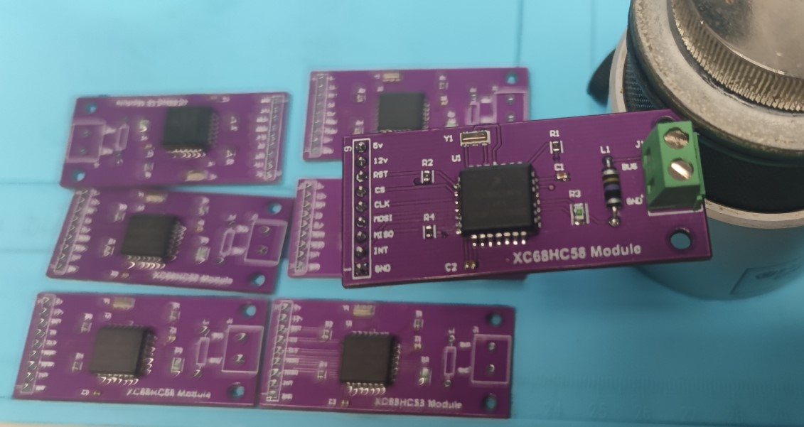
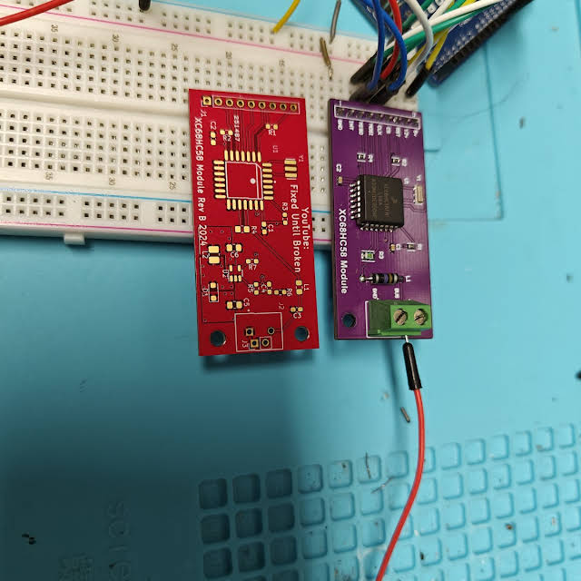

# J1850VPW Module
This module is meant to be able to transmit and receive data on the GM class 2 serial network. This module makes use of the older Motorola XC68HC58 datalink IC. I would recommend you review the datasheet for this IC before you get started.

# Gerber Files
To make this module yourself download the .zip file. It contains all the gerber files needed. you can then upload this with your PCB fab house.

# Building The Module
To build this module, you will need to be able to solder with hot air or hotplate (due to the xtal). Everything else can actually be soldered with just a soldering iron. Use the .html file for your older BOM. You can ignore the mounting holes in the BOM; it's just how Altuim output it, and I didn't edit it. That BOM (the .HTML) is for REV A. Rev B and C have significantly different parts on them vs Rev A. Rev B and C were done in KiCAD. Rev C has the bom in its folder. It is the .csv file

# Sketch
Use the write example .ino to get started in Arduino with this module. This makes use of Arduino built-in SPI drivers, but no special plugins are needed. This First sketch only transmits. Receive Example is working and tested. It is the second sketch.

# Rev B
See the Rev B folder for the Schematic. Due to a Silkscreen Error, Gerber Files won't be available for Rev B. Once complete, Rev C will have files.

# Rev C
Rev C is about the same as Rev B but with silkscreen corrections. The boards I am selling on eBay right now are Rev C. If you want 14V out from the module, just jump JP1. Note that the boost converter can only support about 100ma, so don't overload it, or the module won't work. It's more useful as a telemetry tool to measure at your microcontroller to ensure the boost is working or to power an indicator that tells you it's working. 

# Design With it
If you are using KiCad I have provided a Footprint and symbol. It is the same as my GMLAN module project. Just leave Mode 0 and Mode 1 disconnected, as they won't actually connect with this module. It can be found here: https://github.com/garnerm91/SWCAN/tree/main/FootprintPlusSym 

# Support me!
If you want to buy one from me you should be able to find them on my eBay account. https://www.ebay.com/usr/mattus.i8wvojtcv
You can also support me by contributing code/project. A good way to reach me is matt@untilbroken.com 
